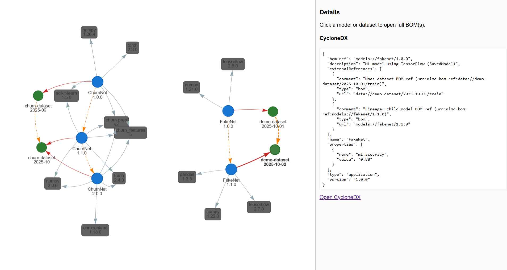

# MLMD-BOM

**Proof of Concept:** Generate CycloneDX BOMs (modelboms and databoms) from ML Metadata (MLMD) with live interactive visualization.

---

## Overview


MLMD-BOM demonstrates how to:
- Create an in-memory MLMD (ML Metadata) store with multiple pipelines, models, datasets, and dependencies.
- Extract model, dataset, and dependency metadata, including lineage and multi-pipeline relations.
- Export the metadata as Bill of Materials (BOM) files in CycloneDX format, as both modelboms and databoms.
- Visualize the resulting graphs live in your browser, with auto-updating and interactive exploration.

Outputs are written to `output/` with format-specific subfolders. For each run, you get:
- Per-model CycloneDX BOMs in `output/cyclonedx/` (modelboms)
- Per-dataset CycloneDX BOMs in `output/cyclonedx/` (databoms)
- Four extracted MLMD JSONs in `output/`:
  - `extracted_mlmd.json` (all)
  - `extracted_mlmd_models.json` (models only)
  - `extracted_mlmd_datasets.json` (datasets only)
  - `extracted_mlmd_multi.json` (multi-pipeline/combined)

<p align="center">
  
</p>

---


## Requirements

- Docker
- Docker Compose

No need to install Python or Node.js locally—everything runs in containers.


## Usage

### Build and Run

```bash
docker compose up --build
```

This will:
- Build the generator image (`mlmd-bom`) and the viewer image (`bom-viewer`)
- Run the generator to produce BOMs into `output/`
- Start a live viewer web app on [http://localhost:8080](http://localhost:8080)
- Write files to `output/` (in your project directory), including:
  - `extracted_mlmd.json` and `extracted_mlmd_multi.json`
  - Per-model CycloneDX BOMs in `output/cyclonedx/`, e.g. `FakeNet-1.0.0.cyclonedx.json`
  - Per-model SPDX 3.0 BOMs in `output/spdx/`, e.g. `FakeNet-1.0.0.spdx3.json`


#### Environment Variables

- `SCENARIO_YAML`: Path to a YAML file that defines the MLMD scenario to load. Defaults to `scenarios/demo-complex.yaml`. To use your own scenario, run:

  ```bash
  SCENARIO_YAML=scenarios/my-scenario.yaml docker compose up --build
  ```

- `EXTRACT_CONTEXT`: Filter which MLMD context to export (uses names from your scenario). For the demo scenario, try:
  - Experiment contexts: `expA`, `expB`
  - Pipeline context: `demo-pipeline`

#### Logging (optional)

- Python generator (`app/`):
  - `LOG_LEVEL`: DEBUG, INFO, WARNING, ERROR, CRITICAL (default: INFO)
  - `LOG_FORMAT`: `plain` (default) or `json`
- Node viewer (`viewer/`):
  - `LOG_LEVEL`: debug, info, warn, error (default: info)
  - `LOG_FORMAT`: `plain` (default) or `json`

#### Examples

- Default (loads the bundled demo scenario): run the compose command above and open [http://localhost:8080](http://localhost:8080)
- Export only one experiment from the demo scenario: set `EXTRACT_CONTEXT=expA` and re-run the generator service; the viewer will auto-refresh when new BOMs are written.
- Use your own scenario: set `SCENARIO_YAML=app/scenarios/my-scenario.yaml` and re-run the generator service.

Enable verbose logging:

```bash
LOG_LEVEL=DEBUG docker compose up --build
```

Emit JSON logs for both services:

```bash
LOG_FORMAT=json LOG_LEVEL=DEBUG docker compose up --build
```


### Visualize the BOMs (Live Viewer)

- Open [http://localhost:8080](http://localhost:8080) for the combined view (CycloneDX modelboms and databoms).
- Click a node to see its CycloneDX JSON in the side panel; links let you open the full BOM files.
- Double‑click a model or dataset node to open its full BOM.
- Nodes are draggable; dependencies cluster around their model; shared dependencies appear between models; lineage edges are dashed orange, dataset relations are red.

The viewer watches `output/cyclonedx` and updates automatically when new files are created or existing files change.


## Lineage and Relationships

Each model and dataset is exported to its own BOM file (modelbom or databom). The newer model version links to its immediate parent when both versions are present. If filtering results in a single version, the BOM is emitted without lineage.

- **CycloneDX (specVersion 1.6):**
  - Dependencies are represented in the dependency graph.
  - Lineage is expressed via an externalReference of type `bom` on the model component using a BOM-Link URN pointing to the parent BOM.
  - Model-dataset relations are also encoded as externalReferences.

docker-compose.yml     # Docker Compose orchestration

## Project Structure

```
app/
  Dockerfile           # App container image
  requirements.txt     # App dependencies
  main.py              # Main entry point
  mlmd_support.py      # MLMD utility functions
  extraction.py        # Extract model + dependencies from MLMD
  cyclonedx_gen.py     # CycloneDX BOM generation (JSON + XML)
  spdx3_gen.py         # SPDX 3.0 JSON generation (per model) (currently not used)
viewer/
  Dockerfile           # Viewer container image (Node)
  package.json         # Viewer web app dependencies and scripts
  server.js            # Live viewer server (Express + chokidar)
  build.js             # Static builder (kept for reference)
output/
  cyclonedx/           # Per-model CycloneDX BOMs
  spdx/                # Per-model SPDX 3.0 BOMs
docker-compose.yml     # Docker Compose orchestration
```


## License

See [LICENSE](LICENSE) for details.